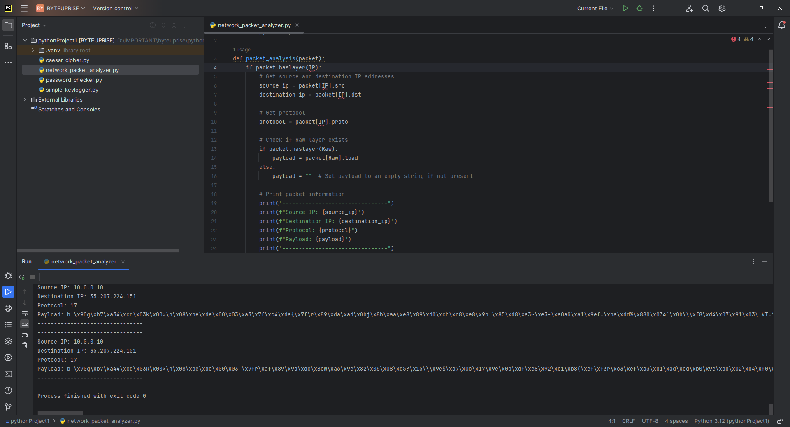

# ByteUprise_task4_CyberSecurity

Excited to share my latest creation: a packet sniffer tool! Capture and analyze network packets, revealing important details such as IP addresses and protocols. Remember, ethical usage is crucial for educational purposes.

# About Network Packet Analyzer

A Network Packet Analyzer, or packet sniffer, is an essential tool for network administrators and security professionals. It allows for detailed inspection of network traffic, helping to identify protocol usage, troubleshoot issues, detect security threats, and optimize network performance. By capturing and analyzing data packets in real-time, it provides valuable insights into network behavior, aiding in both proactive network management and reactive incident response.

# Code
This is the code which i came up with using python [Network Packet Analyzer](network_packet_analyzer.py).

# Output

- Video
If the video does play its in [Here](Media/networkpacket.mp4).

<video controls src="Media/networkpacket.mp4" title="Title"></video>

- Photo

